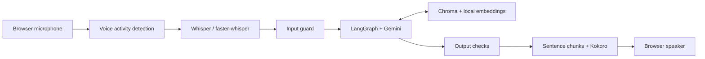

# AI Rababb ? Voice Persona Agent

A voice assistant that answers questions about Rababb Pannu's projects and experience using a Markdown knowledge base. It combines **Whisper speech recognition**, **retrieval with Chroma**, a **LangGraph agent**, and **local Kokoro speech synthesis**.

[Watch the recorded demo](https://drive.google.com/file/d/1Ib6TnhytXvJMXDUZB3i1y0RpPs3Oo22P/view) ? [ASR model release](https://github.com/Rababb-P/CustomVoiceAgent/releases/tag/asr-retrain-2026-09-17) ? [Training walkthrough](docs/ASR_TRAINING.md)

## Try it

**No installation:** [watch the existing recording](https://drive.google.com/file/d/1Ib6TnhytXvJMXDUZB3i1y0RpPs3Oo22P/view). The video is approximately 58 MB. A browser showcase is prepared in [docs/index.html](docs/index.html); it is not yet published as a hosted site.

**Interactive:** run the text agent or browser voice interface locally using the instructions below. The app needs a Gemini API key; speech recognition, embeddings, and speech synthesis run on the application host. There is currently no public interactive endpoint.

Example questions:

- ?What did you build at Hack Canada??
- ?How did you use computer vision in Smart Bin??
- ?Tell me about your WATonomous work.?

## How it works



The agent retrieves supporting passages from `data/corpus/`, calls tools, and applies input and output checks. The non-streaming `/ask` route includes a groundedness judge and one regeneration attempt. The streaming `/converse` route disables that judge and checks each spoken sentence for PII patterns to reduce latency. These checks reduce unsupported responses; they do not guarantee factual accuracy or resistance to every attack.

## Quick start

### 1. Install

Use **Python 3.11+** and run commands from the repository root.

```bash
git clone https://github.com/Rababb-P/CustomVoiceAgent.git
cd CustomVoiceAgent
python -m venv .venv
```

Activate the environment:

| Platform | Command |
| --- | --- |
| Windows PowerShell | `.venv\Scripts\Activate.ps1` |
| macOS / Linux | `source .venv/bin/activate` |

For the text agent:

```bash
python -m pip install -e ".[rag]"
```

For the browser voice interface, install the speech dependencies as well:

```bash
python -m pip install -e ".[rag,asr,tts]"
```

The voice extras also include training libraries. Initial setup downloads model weights, so allow time and disk space. GPU acceleration is optional for inference; performance depends on your machine. If Kokoro reports a missing phonemizer/system dependency, follow the instructions in its error message for your operating system.

### 2. Configure

Copy `.env.example` to `.env` (`Copy-Item .env.example .env` in PowerShell; `cp .env.example .env` on macOS/Linux) and set:

```dotenv
GOOGLE_API_KEY=your-key-here
```

Keep the key in `.env`, which is ignored by Git. Model names and client-side request limits live in [configs/agent.yaml](configs/agent.yaml). Verify that the configured models are available to your account; free-tier eligibility and provider limits can change. Changing the commented model environment variables in `.env.example` does **not** override the current YAML loader.

### 3. Index the knowledge base

The repository already contains public profile and project documents. Review them, or replace them with facts about your own persona, before indexing:

```bash
python -m src.rag.ingest --config configs/rag.yaml
```

This builds the local Chroma index and downloads the embedding model on first use. Rerun ingestion after changing the corpus.

### 4. Ask a question

```bash
python -m src.agent.graph "What did you build at Hack Canada?"
```

Add `-v` for graph and tool traces.

For voice conversations:

```bash
python -m uvicorn src.server.app:app --host 127.0.0.1 --port 8000
```

Open **http://localhost:8000**, allow microphone access, and hold the button or spacebar to speak. The server falls back to base Whisper-small with vocabulary hotwords when the fine-tuned model is absent. If TTS initialization fails, the server can return text, but ASR still needs to load successfully.

### 5. Use the fine-tuned speech model (optional)

Download the int8 CTranslate2 ZIP from the [ASR release](https://github.com/Rababb-P/CustomVoiceAgent/releases/tag/asr-retrain-2026-09-17) and extract it so this directory exists:

```text
models/whisper-personal-ct2/
```

Restart the server. It selects that directory automatically. The repository also includes the smaller [LoRA adapter and model card](artifacts/asr/whisper-small-lora/README.md); loading the adapter separately requires the base Whisper model.

## Measured ASR results

The committed recovery-run evaluation compares int8 exported models with matched decoding settings. **Lower normalized word error rate (WER) is better.**

| Model | Synthetic validation WER | Real-speech test WER |
| --- | ---: | ---: |
| Whisper-small | 5.78% | 21.89% |
| Whisper-small + hotwords | 2.04% | **21.13%** |
| Fine-tuned Whisper-small | **1.02%** | 21.51% |

The fine-tune improves the domain-focused synthetic set; it does not beat hotword biasing on this real-speech test. Each evaluation slice has only 32 examples, and synthetic validation was used to select the checkpoint. These results are not a broad accuracy estimate. See the [model card](artifacts/asr/whisper-small-lora/README.md) and [evaluation data](artifacts/asr/whisper-small-lora/evaluation.json).

The recovery run used 512 training examples and three epochs, selecting epoch two. The [executed notebook](notebooks/asr_finetune_pytorch.ipynb) documents an earlier GPU run, with different results.

## Engineering details

- **Domain ASR:** synthetic speech, real-speech mixing, Whisper LoRA training, hotword baseline, and CTranslate2 export.
- **Retrieval:** Markdown header-aware chunks, local `BAAI/bge-small-en-v1.5` embeddings, source metadata, and Chroma persistence.
- **Agent:** retrieval and clarification tools, bounded tool iteration, and graph-based guard decisions.
- **LLM wrapper:** per-model request limiting, retries, and disk caching for supported non-streaming calls. Streaming responses are not cached by LangChain.
- **Voice transport:** 16 kHz mono PCM16 microphone input over WebSockets; sentence-level synthesis and PCM16 playback.
- **Evaluation:** ASR WER, retrieval recall/MRR, answer judging, adversarial fixtures, and an explicit regression-gate command.

## Tests and evaluation

```bash
python -m pip install -e ".[dev,rag]"
python -m pytest -q
```

Unit tests use fakes where appropriate and do not require a live API key. Full evaluations have additional data/model requirements, and agent/judge suites use Gemini:

```bash
python -m evals.report
python -m evals.report --ci
python -m evals.run_redteam
```

`--ci` applies the implemented regression thresholds; this repository does not currently contain a GitHub Actions workflow that automatically runs that gate. See [data/README.md](data/README.md) for fixture formats. Linux/macOS users with Make can also use the targets in [Makefile](Makefile).

## Project map

| Path | Purpose |
| --- | --- |
| [src/asr/](src/asr/) | Data generation, training, export, and transcription |
| [src/agent/](src/agent/) | Persona, tools, and LangGraph workflow |
| [src/rag/](src/rag/) | Corpus ingestion and retrieval |
| [src/guardrails/](src/guardrails/) | Input checks, groundedness checks, and PII policy |
| [src/tts/](src/tts/) | Sentence chunking, Kokoro, optional Chatterbox |
| [src/server/](src/server/) | FastAPI `/converse` and `/ask` routes |
| [static/index.html](static/index.html) | Local browser microphone interface |
| [evals/](evals/) and [tests/](tests/) | Evaluation harness and unit tests |
| [docs/ASR_RETRAINING.md](docs/ASR_RETRAINING.md) | Recovery-run reproduction steps |
| [docs/HOSTING.md](docs/HOSTING.md) | Showcase publishing and interactive hosting requirements |

## Data, privacy, and limitations

The Markdown corpus and selected evaluation fixtures **are committed publicly**. Raw audio, model downloads, the vector index, and response caches are ignored by Git. Audio is processed on the application host; transcripts, conversation context, and retrieved passages can be sent to Gemini. Local response caches may contain prompt/response content. Review corpus content and the provider's terms before using private information.

The app is a local prototype. Public interactive hosting needs HTTPS, authenticated or otherwise controlled access, usage limits, upload/connection limits, and an appropriate data-retention policy. The existing server does not implement these protections. Barge-in and optional voice cloning are not part of the default interaction.

## Author and licensing

Built by [Rababb Pannu](https://github.com/Rababb-P). No repository-wide license is currently included. Third-party libraries, datasets, and models retain their respective licenses; the exported Whisper artifacts include a [Whisper license notice](artifacts/asr/whisper-small-lora/WHISPER_LICENSE).
